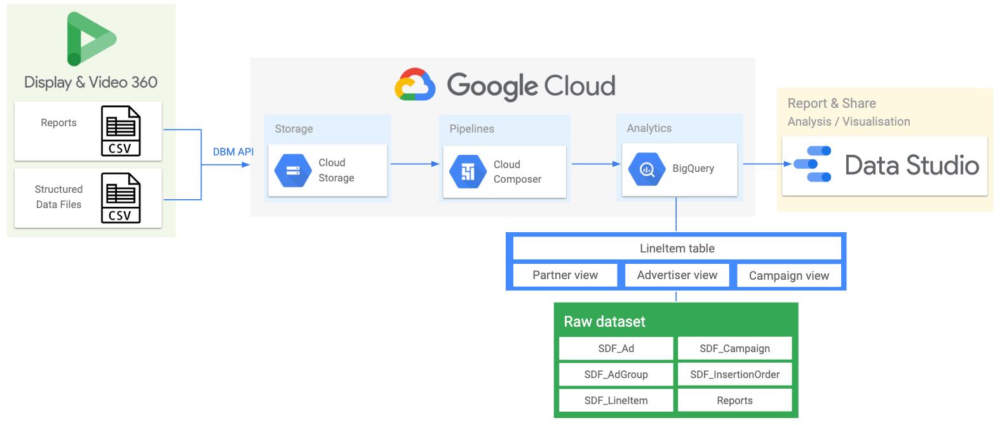

*This is not an officially supported Google product.*

# Spindle

## What is Spindle?

Spindle is a QA and feature adoption dashboard for Display & Video 360 (DV360) advertisers. It can be used to quickly identify financial (e.g. overspend) or reputational (e.g. brand safety) risk, and validate best practice across multiple advertisers. Spindle uses a set of predefined ‘flags’ to stack rank DV360 entities according to potential risk, but is fully configurable, and can be customised to check for specific best practice or flags (e.g. adherence to naming conventions, brand safety controls, audience, geo targeting, etc).

Spindle utilises [Orchestra](https://github.com/google/orchestra), an open source data orchestration tool developed on Google Cloud Composer. This repository is intended to streamline the deployment of Spindle and the necessary components from Orchestra, to a new or existing Cloud Composer environment.

### Architecture



## Installation

The easiest and quickest way to deploy Spindle, is by using this deployment script. New deployments should take approximately 25 minutes to complete. Deployments to existing Composer environments should finish in under 5 mins.

### Before you begin

#### Prepare your Cloud project
This script will use the default service credentials for Compute Engine ("Compute Engine default service account"). These service accounts have access to all Cloud APIs enabled for your Cloud project, making them a good fit for Spindle/Orchestra.

*   Make sure that billing is enabled for your Google Cloud project
*   Enable the [Cloud Composer](https://console.cloud.google.com/apis/library/composer.googleapis.com) and [DoubleClick Bid Manager](https://console.cloud.google.com/apis/api/doubleclickbidmanager.googleapis.com/overview) API from the [API Library](https://console.cloud.google.com/apis/library)
*   **Important**: create your destination BigQuery dataset **before** deployment. The Spindle pipeline will fail if the dataset does not exist prior to execution, to prevent accidentally overwriting existing datasets.

> :exclamation: If deploying to an existing Composer environment, ensure it has DoubleClick Bid Manager included in the 'Google API scopes' or Airflow connection.

#### Create Display & Video 360 user

Your Compute Engine service account email (similar to XX-compute@developer.gserviceaccount.com) will need to be setup as a DV360 user so that it can access data from your DV360 account. DV360 partner-level access is required to [create a new user](https://support.google.com/displayvideo/answer/2723011?hl=en). New DV360 users should be created using this configuration:

*   'User email' should be the email associated with your default service account
*   Select all Partner IDs you wish to access with Spindle
*   Ensure the user is given 'Read & write' access permission

### Pipeline setup

1.   Launch a new [Cloud Shell](https://cloud.google.com/shell/docs/launching-cloud-shell) with the code editor [activated](https://ssh.cloud.google.com/cloudshell/editor)
3.   From the Cloud Shell, clone this repository:

```shell
git clone https://github.com/google/spindle-dv360
```
4.   From the code editor, use the left-hand pane to find and open the configuration file called `spindle.config`

For deployments to a **new** Composer instance, `spindle.config` should follow this template:

| Field |  | Description | Example |
| :----- | :--------- | :----- | :---------- |
| *cloud_project_id*| Required | Google Cloud Project ID | my-gcp-project1  |
| *bq_dataset* | Required | BigQuery destination dataset name | spindle_clientname |
| *composer_gcs_bucket* | Optional | Cloud Storage bucket URI. Do not include leading 'gs://' or trailing '/dags' | Leave blank for new Composer instances |
| *install_composer*| Required | Indicates whether to create a new Composer instance | true  |
| *composer_location*| Required | Compute Engine [region](https://cloud.google.com/compute/docs/regions-zones#locations) | europe-west1  |
| *composer_zone* | Required | Compute Engine [zone](https://cloud.google.com/compute/docs/regions-zones#locations) | europe-west1-c |


Your completed `spindle.config` should look similar to:

```json
{
  "cloud_project_id": "my-gcp-project1",
  "bq_dataset": "spindle_clientname",
  "composer_gcs_bucket": "",
  "install_composer": "true",
  "environment_name": "clientname-spindle",
  "composer_location": "europe-west1",
  "composer_zone": "europe-west1-c"
}
```
For deployments to an **existing** Composer instance:

| Field |  | Description | Example |
| :----- | :--------- | :----- | :---------- |
| *cloud_project_id*| Required | Google Cloud Project ID | my-gcp-project1  |
| *bq_dataset* | Required | BigQuery destination dataset name  | spindle_clientname |
| *composer_gcs_bucket* | Required | Cloud Storage bucket URI. Do not include leading 'gs://' or trailing '/dags' | europe-west2-spindle-42cn4da-bucket |
| *install_composer*| Required | Indicates whether to create a new Composer instance | false  |


Your completed `spindle.config` should look similar to:

```json
{
  "cloud_project_id": "my-gcp-project1",
  "bq_dataset": "spindle_clientname",
  "composer_gcs_bucket": "europe-west2-spindle-42cn4da-bucket",
  "install_composer": "false",
  "environment_name": "",
  "composer_location": "",
  "composer_zone": ""
}
```

5.  After updating `spindle.config`, execute the following in the Cloud Shell:

```shell
cd spindle-dv360
. deploy.sh spindle.config
```

If you've used this script to create a new Composer instance, most of the Airflow configuration has been done for you, but you'll need to update your DV360 Partner IDs...

6.  Open your 'Airflow webserver' from the  [Composer environments list](https://console.cloud.google.com/composer/environments). Navigate to Admin >> Variables, update the variable called 'partner_ids'. Partner IDs must be surrounded by double quotes and comma-separated e.g. "1234", "5678".

If you're deploying to an existing Composer environment, Airflow variables must be created manually, [detailed here](https://github.com/google/orchestra#variables), to prevent overwriting or breaking an existing configuration.

### Dashboard setup

By default, the Spindle DAG is configured to run at 10PM daily. This means that your new BigQuery tables will not be generated until the first run has finished. Once your pipeline has finished for the first time, and BigQuery dataset populated, you should proceed with this setup.

> :warning: **Warning:** manually triggering the DAG outside the schedule (10pm) may result in duplicate rows in your dataset.

1.   Make copies of the x4 Data Studio data source templates. It's important that you create copies of the data sources before copying the report, otherwise you'll lose all customisations to the data source.
*   Open [LineItem view](https://datastudio.google.com/datasources/804045dc-2666-4024-8015-f9bd7a105e1c) -- click 'Make a copy of this datasource`, then 'Edit connection', and associate the new data source with the corresponding table in your BigQuery dataset: '**spindle_lineitem_view**'. Under 'Coniguration' > 'Partitioned Table', be sure to tick the option to "Use report_date as partitioning column". Click 'Reconnect'.
*   Open [Partner view](https://datastudio.google.com/datasources/e0fc3902-1fe6-42a2-b97c-0aa59aeacb48) -- click 'Make a copy of this datasource', then 'Edit connection', and associate the new data source with the corresponding view in your BigQuery dataset: '**spindle_partner_view**'. Click 'Reconnect'.
*   Open [Advertiser view](https://datastudio.google.com/datasources/e5df4f24-027c-4879-9709-92636c7026bb) -- click 'Make a copy of this datasource', then 'Edit connection', and associate the new data source with the corresponding view in your BigQuery dataset: '**spindle_advertiser_view**'. Click 'Reconnect'.
*   Open [Campaign view](https://datastudio.google.com/datasources/eb86791e-c30f-48fd-b2e1-3acca76042ab) -- click 'Make a copy of this datasource', then 'Edit connection', and associate the new data source with the corresponding view in your BigQuery dataset: '**spindle_campaign_view**'. Click 'Reconnect'.
2.   Open the Data Studio [report template](https://datastudio.google.com/reporting/6bb24ab5-858a-4e4a-a8d8-4409f7e0b5bb) -- click 'Make a copy of this report'. You'll be prompted to select new datasources. Swap out the 'Original data source' with the copies you created in the previous steps and click 'Copy Report'.
3.   Your report should automatically populate with data from your new BigQuery dataset. It may take a couple of days for all charts to render correctly, as many are date filtered on today -2 days (to ensure data availability).

> :warning: **Warning:** sharing the Data Studio dashboard with other users will allow them to view all data in the dashboard, regardless of whether they have the underlying DV360 account access permissions to view the DV360 Partner(s) surfaced in the dashboard. Access to the dashboard should be carefully managed and controlled.

## Data & Privacy

[Orchestra](https://github.com/google/orchestra) is a framework that allows powerful API access to your data. Liability for how you use that data is your own. It is important that all data you keep is secure and that you have legal permission to work and transfer all data you use. Orchestra can operate across multiple Partners, please be sure that this access is covered by legal agreements with your clients before implementing Orchestra. This project is covered by the Apache License.

## License

Apache 2.0